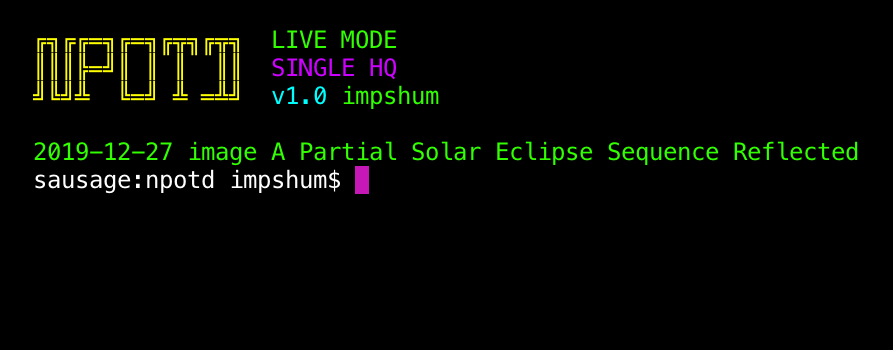

## NPOTD

Downloads NASA picture of the day to your chosen desktop background folder. Also comes with an archive mode to download them all.

### Instructions

-   Install requirements `pip install -r requirements.txt`
-   Get your API key from https://api.nasa.gov
-   Edit conf.ini with your details
-   Run it `python run.py`

#### Settings Info

-   `single_mode = on` - Only keeps 1 image in the folder (deletes all others)
-   `single_mode = off` - Adds images to folder (collects all)
-   `hd_mode` - Choose between high/low quality images
-   `download_dir` - The folder where the images are downloaded to

#### Archive Info

-   `archive_mode` - Ignores all settings and downloads all image history
-   `archive_days` - Days to go back to in archive mode

### Notes

This script is designed to work with a selected folder.   
If in single mode your desktop background will change automatically when a new image is downloaded. If not it's advised to randomise your background from the folder.
